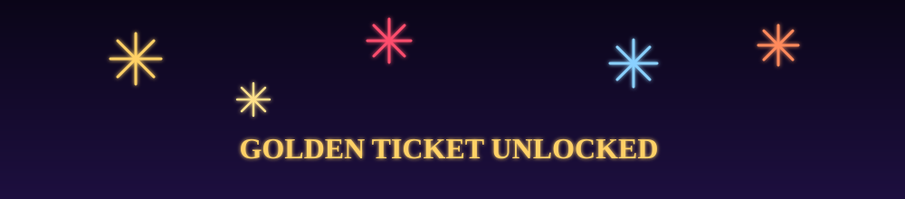

<div align="center">



<br/>

[](#)
[](#)
[](#)
[](#-license)
[](#-contributing)

### 🕸️ A voice-driven, 3D, AI-powered cinematic invitation experience


</div>


## 📖 Table of contents

- [🕸️ What is this?](#what-is-this)
- [🕸️ Why this template exists](#why-this-template-exists)
- [🚀 Quick start](#quick-start)
- [🎙 Want fully free, offline voice?](#want-fully-free-offline-voice)
- [🛠 Customisation guide](#customisation-guide)
- [🌍 Sharing the mission with your guest](#sharing-the-mission-with-your-guest)
- [📁 Project structure](#project-structure)
- [🧠 How the pieces fit together](#how-the-pieces-fit-together)
- [🎭 Tech stack](#tech-stack)
- [⚙️ Scripts](#scripts)
- [🔒 Privacy and security](#privacy-and-security)
- [⚖️ Trademark and IP notice](#trademark-and-ip-notice)
- [🤝 Contributing](#contributing)
- [📜 License](#license)


## 🕸️ What is this? <a id="what-is-this"></a>

**The Web Mission** is a single-page, voice-first web experience — built for one person, by one person, then set free as an open-source template. You give it to someone special. They land on a wax-sealed gate, type their name, grant the mic, and a charming AI guide named **Parker** walks them through a multi-stage cinematic journey:

| # | Stage | What happens |
|---|-------|---------------|
| 0 | **The Gate** | A wax-sealed lock screen. Only the right name (and its 40+ spellings) opens the web. |
| 0.5 | **Voice** | The biometric orb — tap, allow the mic, the journey becomes spoken. |
| I | **Mission Brief** | Parker introduces the night. |
| II | **IELTS Trial** | A friendly examiner gives speaking prompts + Band 0–9 verdicts. |
| III | **Web of the Heart** | The conversation deepens — dreams, fears, real talk. |
| IV | **The Question** | Parker reveals who sent you, then asks the question. |
| ✅ | **Booked** | The guest said yes. Golden ticket drops. Fireworks. The hero descends to celebrate. |

All of it plays against a real-time 3D night city — a caped figure swings on a silk thread above a hypercar that cruises neon-lit streets, the city's windows brighten when the guest speaks, and fireworks light up the sky when the answer is yes.

> It works with zero configuration — open the page, walk through the journey, see offline mode in action. Add an OpenAI key and Parker becomes fully alive.


## 🕸️ Why this template exists <a id="why-this-template-exists"></a>

This project was originally built personally for one person. It worked beautifully. The author ([@rzhbadhon](https://github.com/rzhbadhon)) open-sourced it so that:

- **Anyone** can clone it, customise the names / movie details / personality / 3D scene, and gift a similar experience to their own special someone.
- **An AI agent** can be pointed at the repository and immediately understand what every file does, what to edit, and how to wire it up — every file is heavily commented.
- **Anyone** can learn from it — the codebase is small enough to read in an afternoon and uses Next.js 14, Three.js, r3f, Framer Motion, the Web Speech API, and a tiny AI endpoint, all together in one tight package.

💡 Whoever you are, this template is yours now. Make it your own. Re-theme it (you don't have to keep the superhero references — swap them for any hero, any city, any car). Re-write Parker's tone. Re-skin the gate. Make your recipient feel seen.


## 🚀 Quick start <a id="quick-start"></a>

### Prerequisites

- **Node.js 18.18+** (20 LTS recommended)
- **npm 9+** (or pnpm / yarn — your call)
- A modern browser that supports the Web Speech API: Chrome desktop/Android, Safari iOS 14.5+, Edge. Firefox doesn't ship speech recognition — the journey gracefully falls back to typed input.

### 1. Clone & install

```bash
git clone https://github.com/rzhbadhon/the-web-mission.git
cd the-web-mission
npm install
```

### 2. (Optional) Add an AI brain

Copy the env template and add an OpenAI-compatible API key. Skip this step and the journey still plays — Parker just speaks offline comfort lines and the levels never advance (deliberate, so you can tell at a glance whether the AI was live while testing).

```bash
cp .env.example .env.local
# edit .env.local → set OPENAI_API_KEY=sk-...
```

### 3. Run

```bash
npm run dev
```

→ `http://localhost:3000`

Open the URL in Chrome. Type the configured name (default: `guest`, `superstar` — change in `src/lib/invitation/config.ts`). Allow the mic. Talk.

### 4. (Optional) See the mission log

Visit `http://localhost:3000/?admin=spidey` (the `ADMIN_KEY` from `.env`). You'll see every journey attempt — name typed, stage reached, whether they said yes, and whether the AI was live or offline during each reply.


## 🎙 Want fully free, offline voice? <a id="want-fully-free-offline-voice"></a>

The default setup uses Chrome's built-in Web Speech API (free, no install). If you want fully local, no-cloud, no-API-key speech recognition and synthesis on Windows — using open-source engines like Whisper (STT) and Piper (TTS) — there's a complete guide:

→ **[`docs/VOICE_FREE_WINDOWS.md`](docs/VOICE_FREE_WINDOWS.md)** — 20-minute setup, $0 cost, runs entirely on your PC.


## 🛠 Customisation guide <a id="customisation-guide"></a>

Everything personal lives in one file: **`src/lib/invitation/config.ts`**. Open it. You'll find well-commented sections for:

| Section | What it controls |
|---|---|
| `Stage` type | The journey stages (add/rename — careful, the agent prompt references these) |
| `VOICE_LANG` | The locale the guide speaks in (`"en-US"` / `"bn-BD"`) |
| `HIM.name` | The host's name — appears on the ticket, revealed during the invite stage |
| `HOST_REVEAL_TOKEN` | A token the AI uses when revealing the host (used by the pacing logic too) |
| `SITE` | The gate's branding — wax-seal letter, codename, tagline |
| `MOVIE` | The ticket details — title, date, time, place, seats |
| `CANONICAL_IDS` | The internal ids the gate matches against |
| `GATE_NAMES` | The accepted names + every spelling variant you can think of |
| `GATE_HINTS` | Hints revealed after N failed attempts |
| `GATE_REJECTIONS` | The roast lines for wrong names |
| `OFFLINE_COMFORT` / `BOOKED_COMFORT` | Fallback replies when the AI is unreachable |

For deeper changes (personality, AI tone, stage behaviour, agent prompts), see:

- **[`docs/CUSTOMIZATION.md`](docs/CUSTOMIZATION.md)** — full personalisation walkthrough
- **[`docs/SETUP.md`](docs/SETUP.md)** — environment, deployment, troubleshooting
- **`src/app/api/agent/route.ts`** — Parker's system prompt (edit the personality)


## 🌍 Sharing the mission with your guest <a id="sharing-the-mission-with-your-guest"></a>

You have three options, easiest first:

**Option A · Cloudflare Tunnel (recommended, free, no deploy)**
Run the mission on your own laptop; expose it to the public internet via a free Cloudflare tunnel. Your guest opens the tunnel URL — they're talking to your laptop. When they're done, kill the tunnel and the link is gone forever.

→ See **[`docs/CLOUDFLARE_TUNNEL.md`](docs/CLOUDFLARE_TUNNEL.md)** for step-by-step (5 minutes, zero deploy).

**Option B · One-click deploy**
The repo is a standard Next.js app — deploy to Vercel, Netlify, Cloudflare Pages, or any Node-capable host. Set your `OPENAI_API_KEY` and `ADMIN_KEY` in the host's env panel. Done.

```bash
npm i -g vercel
vercel
```

**Option C · Local network only**
If your guest is on the same Wi-Fi as you (or you'll hand them your phone), just run `npm run dev` and visit `http://<your-ip>:3000`. No tunnel needed.


## 📁 Project structure <a id="project-structure"></a>

<details>
<summary><strong>Click to expand the full file tree</strong></summary>

```text
the-web-mission/
├── src/
│   ├── app/
│   │   ├── api/
│   │   │   ├── agent/route.ts        ← Parker (the AI guide) endpoint
│   │   │   └── journey/route.ts      ← journey log (POST = save, GET = read)
│   │   ├── globals.css               ← Tailwind + every wm-* animation keyframe
│   │   ├── layout.tsx                ← Next.js root layout
│   │   └── page.tsx                  ← the single entry page
│   ├── components/
│   │   ├── invitation/
│   │   │   ├── BootCinematic.tsx     ← first-load hero swing animation
│   │   │   ├── MissionExperience.tsx ← the brain: stage machine, voice wiring
│   │   │   ├── NameGate.tsx          ← the classified lock screen
│   │   │   ├── VoiceStage.tsx        ← mic-permission orb
│   │   │   ├── JourneyChat.tsx       ← conversation cockpit + per-stage atmospheres
│   │   │   ├── TicketCard.tsx        ← the golden finale ticket
│   │   │   ├── AdminViewer.tsx       ← the /?admin= log viewer
│   │   │   └── scene3d/              ← the whole r3f world: city, car, hero, fireworks
│   │   └── ui/                       ← shadcn/ui primitives (button, input)
│   └── lib/
│       ├── invitation/
│       │   ├── config.ts             ← ★ THE file to edit for personalisation ★
│       │   ├── store.ts              ← zustand journey state
│       │   ├── use-voice.ts          ← Web Speech API wrapper (TTS + STT)
│       │   ├── audio-bus.ts          ← the bridge between voice & 3D scene
│       │   ├── sanitize.ts           ← defensive reply scrubber
│       │   └── name-match.ts         ← forgiving gate name matcher
│       └── utils.ts                  ← shadcn cn() helper
├── docs/
│   ├── CUSTOMIZATION.md              ← deep personalisation guide
│   ├── SETUP.md                      ← env + deployment + troubleshooting
│   ├── CLOUDFLARE_TUNNEL.md          ← free tunnel setup (recommended)
│   ├── VOICE_FREE_WINDOWS.md         ← fully free local STT/TTS on Windows
│   └── GITHUB_PUSH.md                ← contribution workflow
├── public/                           ← static assets
├── assets/                           ← README banners (this revamp)
├── .env.example                      ← all env vars, documented
├── .gitignore
├── components.json                   ← shadcn config
├── next.config.js
├── package.json
├── postcss.config.js
├── tailwind.config.ts
├── tsconfig.json
├── README.md                         ← you are here
├── LICENSE                           ← MIT
└── CHANGELOG.md
```

</details>


## 🧠 How the pieces fit together <a id="how-the-pieces-fit-together"></a>

<details>
<summary><strong>Click to expand the architecture diagram</strong></summary>

```text
┌─────────────────────────────────────────────────────────────────────┐
│                          The Browser (client)                       │
│                                                                       │
│  ┌───────────────────┐   ┌────────────────────┐   ┌───────────────┐ │
│  │ MissionExperience  │ → │  JourneyChat       │ ← │  VoiceStage   │ │
│  │ (stage machine)    │   │  (conversation UI) │   │  (mic orb)    │ │
│  └─────────┬──────────┘   └─────────┬──────────┘   └───────┬───────┘ │
│            │                        │                      │        │
│            ▼                        ▼                      ▼        │
│   ┌────────────────┐   ┌────────────────────┐   ┌─────────────────┐ │
│   │  useJourney     │   │  useVoice          │   │  audioBus       │ │
│   │  (zustand)      │   │  (Web Speech API)  │   │  (voice → 3D)   │ │
│   └─────────────────┘   └─────────┬──────────┘   └────────┬────────┘ │
│                                   │                       │          │
│                                   ▼                       ▼          │
│                          ┌─────────────────┐    ┌──────────────────┐ │
│                          │ /api/agent       │    │  Scene3D         │ │
│                          │ (Parker — AI)    │    │  (Three.js city, │ │
│                          │                  │    │  hero, car …)    │ │
│                          └────────┬─────────┘    └──────────────────┘ │
└───────────────────────────────────┼───────────────────────────────────┘
                                     │
                                     ▼
                     ┌─────────────────────────────────┐
                     │  Your LLM (OpenAI / Anthropic /  │
                     │  Gemini / local Ollama, etc.)    │
                     └─────────────────────────────────┘
```

</details>

**The flow:**

1. The guest types their name at the Gate → the name-match module forgives typos.
2. They grant the mic at VoiceStage → `use-voice` starts STT + TTS via the Web Speech API.
3. Every voice turn goes to `/api/agent` → which calls your LLM (or returns offline comfort).
4. The reply is sanitised and pushed to the zustand store → the `JourneyChat` re-renders.
5. The `audioBus` mirrors voice levels → the `Scene3D` brightens the city in real time.
6. The journey is also POSTed to `/api/journey` → read the log at `/?admin=`.


## 🎭 Tech stack <a id="tech-stack"></a>

| Layer | Library | Why |
|---|---|---|
| Framework | Next.js 14 (App Router) | API routes + React in one process |
| 3D | three.js + @react-three/fiber + @react-three/drei | The cinematic night world |
| Animation | framer-motion | Stage transitions, particles, the boot cinematic |
| Voice | Web Speech API (built into the browser) | No SDK, no API key, no usage cost |
| State | zustand | One store, no context boilerplate |
| UI | shadcn/ui (Radix + Tailwind) | The form/button/dialog primitives |
| AI | OpenAI-compatible chat completions | Swap in any LLM — Anthropic, Gemini, Ollama, … |

No external image, audio, or model assets — every texture (city windows, road, web decal, fireworks glow, moon) is generated procedurally on a canvas at runtime. The whole repo is the experience.


## ⚙️ Scripts <a id="scripts"></a>

| Command | What it does |
|---|---|
| `npm run dev` | Start the dev server on `:3000` |
| `npm run build` | Production build |
| `npm run start` | Run the production build |
| `npm run lint` | ESLint (`next/core-web-vitals`) |
| `npm run type-check` | `tsc --noEmit` — TypeScript only |
| `npm run tunnel` | `cloudflared tunnel --url http://localhost:3000` (free public URL) |


## 🔒 Privacy and security <a id="privacy-and-security"></a>

- The journey never leaves the guest's browser except for two calls: one to `/api/agent` (their last ~12 messages, no PII), one to `/api/journey` (the same plus a session id). Both go to your own server, never to a third party.
- The `/api/journey` GET endpoint is gated behind `ADMIN_KEY` (default `spidey` — change it).
- All AI replies are run through `sanitize.ts` — control chars stripped, length capped, HTML-safe. There is no path by which the AI can inject markup into the page.
- The mic level analyser uses `getUserMedia` only after the user taps the orb — never silently.
- The `localStorage` persistence (so the journey resumes on reload) is keyed to the browser; nothing is sent home if the server is unreachable.


## ⚖️ Trademark and IP notice <a id="trademark-and-ip-notice"></a>

This template references superhero tropes and pop-culture-style branding for personal, customisable, non-commercial use. Any such references are not covered by the MIT license and remain the property of their respective trademark holders. Before you publish your own version, re-theme it — swap the hero, the city, the car — make it your own.


## 🤝 Contributing <a id="contributing"></a>

PRs welcome. See **[`docs/GITHUB_PUSH.md`](docs/GITHUB_PUSH.md)** for the workflow (fork → branch → PR).

For feature ideas: see **[`CHANGELOG.md`](CHANGELOG.md)** for what's already done and the open issues for what's planned.


## 📜 License <a id="license"></a>

**MIT** — © 2026 The Web Mission contributors.

You are free to use, fork, modify, and share — for personal, commercial, or educational purposes. Be kind.

<br/>

<div align="center">

</div>

<div align="center">

### 🕸️ "The web keeps no copies. Screenshot this."

⭐ [Star this repo](../../stargazers) &nbsp;·&nbsp; 🍴 [Fork it](../../fork) &nbsp;·&nbsp; 🐛 [Report an issue](../../issues)

**Maintained by [@rzhbadhon](https://github.com/rzhbadhon)** · Built with 🕷️ and ❤️

</div>